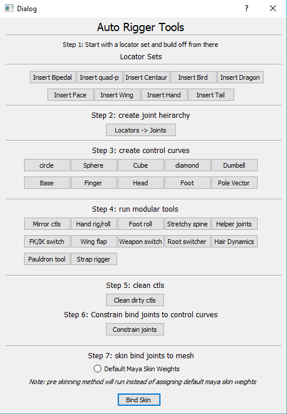

# Auto_rigging_tool_collection
A collection modular rigging tools to make efficiently simple game ready rigs in Autodesk Maya

## Prerequisites:

* PyQt5
* Autodesk Maya 2018

## Built with:

* PyQt5
* Maya.cmds

## Main UI window wireframe:

## How to use:

### Step 1: Add Locator sets to the scene, and position locators

    Add any locator set(s) to lay out positions for any joints that you..
    .. would have on your rig.

### Step 2: Make the joint heirarchy from the locators in the scene
 
    Create the joint heirarchy from the locators in the scene.

### Step 3: Create individual control curves for bind joints

    Create control curves for joints by selecting target joints..
    .. and using corresponding GUI buttons for the type of control..
    .. curve desired.

### Step 4: Run modular scripts for specific features

    Use any of the modular feature scripts to construct more complicated features..
    .. such as an FK/IK Switches, Root Switchers, Hair dynamics etc.

    GUI buttons will launch their own individual dialog windows that prompt..
    .. the user on how to run the script properly.

### Step 5: Clean any rig control curves that have transform information on them

    Clean control looks for control curves that have any translate, rotation,..
    .. or scale information and zero's the information out to have..
    .. clean control curves.

### Step 6: Constrain unconstrainted bind joints to the control curves

    This Function searches for any bind joints that are missing any..
    .. sort of contraints on them, then parent constrainting the..
    .. corresponding control curve (constrainor) to the joint(contrainee)

### Step 7: Bind the mesh to the bind joint heirarchy

    selects the bind heirachy and the mesh and binds the mesh to..
    .. the joint heirachy
